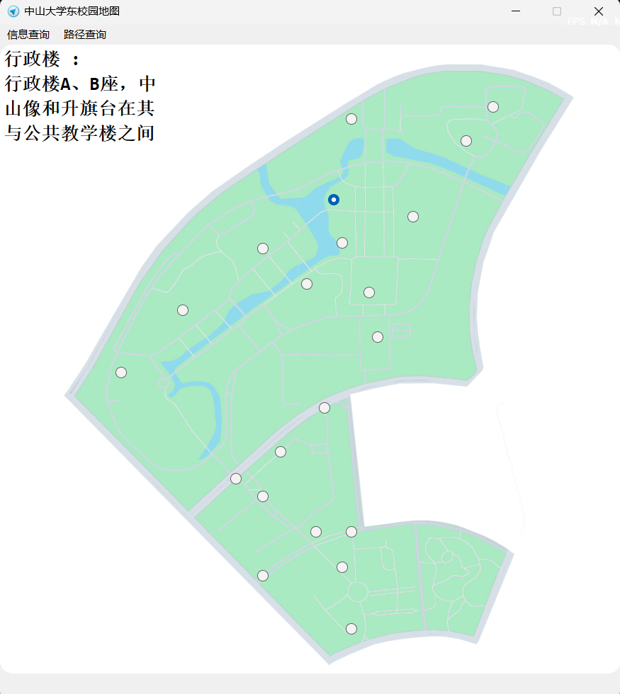
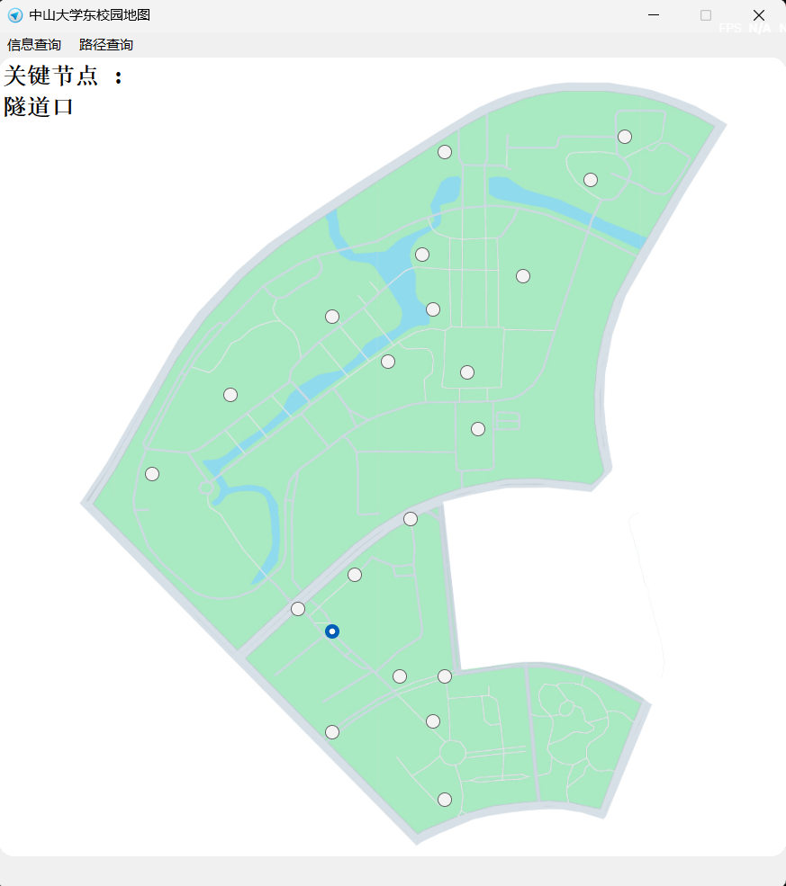
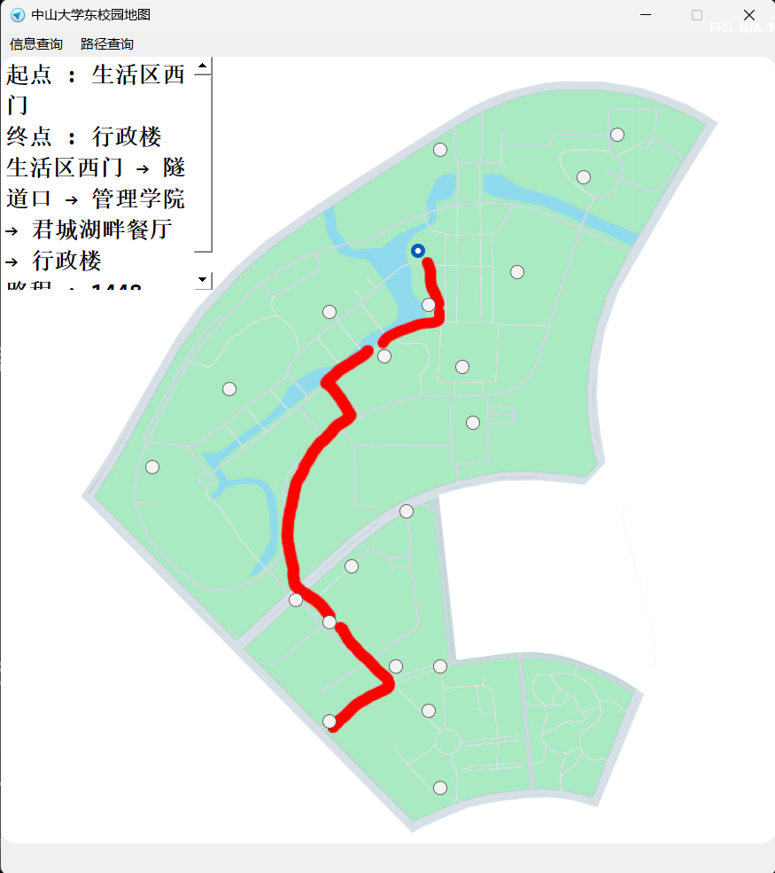
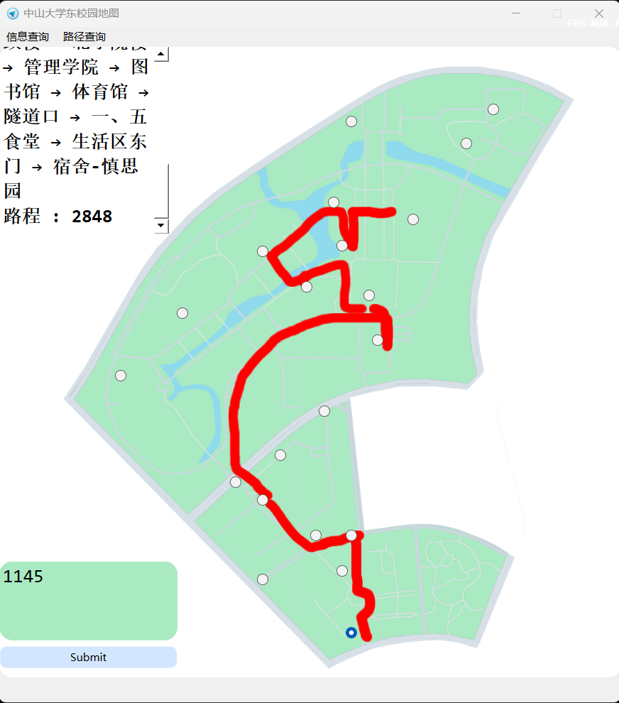

# README

数据结构 大作业3：中大东校园的简单地图

本程序使用 IDE : `Vscode`,`Qt Creator` Lang : `C++(C++11及以上)` Frame : `Qt 6.5` Toolkit : `MinGW_64` MakeTool : `CMake 3.16` 编写，使用**`UTF-8`**编码。

## 功能

本程序基于中山大学东校区地图设计，有以下四点功能：

> 1. 单个地点的信息查询。对于中山大学东校区地图上标注的二十一个地点可以查询每个地点的名称和它的详细信息
> 2. 查询图中的关节点。关节点是地图上重要的一个点，是地图上的交通枢纽。
> 3. 查询从选定起点到终点的最短路径。可以提供从起点到终点的最短路径，并可视化显示路径，同时提供最短距离。
> 4. 查询从选定起点到终点的所有路径。

## 使用须知

> 1. 程序启动时默认为单个地点的信息查询状态，可以点击地图上的圆点进行信息查询。
> 2. 所有功能都在菜单栏中选择。其中信息查询菜单包含 “地点信息查询” 和 “查询关键节点” 两个功能选项，路径查询菜单包含 “路径规划” 和 “查询两地所有路径” 两个功能选项。
> 3. 查询得到的信息都显示在窗体左上角的文本浏览框中。
> 4. “查询两地所有路径” 功能会提供一个输入框，以选择所有路径中的其中一条路径。
> 5. 路径查询时，上一次查询的起点将成为下一次查询的终点，新选择的地点总是起点。

## 效果演示

1. 单点查询

   

   

2. 关键节点查询

   

   

3. 路径规划

   

   

4. 两点间所有路径（任选一条展示）

   

## 代码

源代码在 Codes 文件夹，使用 Qt Creator 打开 VisualMap 文件夹以便于查看工程。
